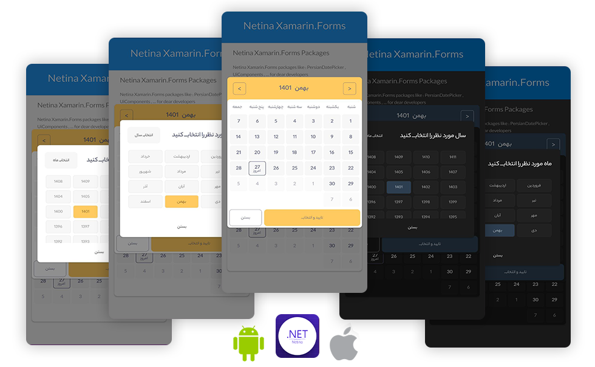

 # Netina.PersianDatePicker [](https://www.nuget.org/packages/Netina.PersianDatePicker/) [](https://www.nuget.org/packages/Netina.PersianDatePicker/) [](https://github.com/Netina/Netina.PersianDatePicker/issues)


Persian DatePicker for .NET Framework ( Xamarin.Forms , .NET MAUI , WPF , ... )

### Setup
    Install-Package Xam.Netina.PersianDatePicker
* Available on NuGet: [https://www.nuget.org/packages/Netina.PersianDatePicker](https://www.nuget.org/packages/Netina.PersianDatePicker/) 



### Add Init to platforms 
You have to add Init() method to each platform you used 
iOS
```C#
[Register("AppDelegate")]
public partial class AppDelegate : global::Xamarin.Forms.Platform.iOS.FormsApplicationDelegate
{
    public override bool FinishedLaunching(UIApplication app, NSDictionary options)
    {
      Xam.Netina.DatePicker.Forms.Platforms.Droid.Platform.Init(this);
      
      global::Xamarin.Forms.Forms.Init ();
      LoadApplication (new App ());
      return base.FinishedLaunching (app, options);
    }
}
```
Android
```C#
namespace NetinaTest.XamarinForms.Droid
{
    [Activity(Label = "NetinaTest.XamarinForms", MainLauncher = true , 
    ConfigurationChanges = ConfigChanges.ScreenSize | ConfigChanges.Orientation)]
    public class MainActivity : global::Xamarin.Forms.Platform.Android.FormsAppCompatActivity
    {
        protected override void OnCreate(Bundle savedInstanceState)
        {
            base.OnCreate(savedInstanceState);

            Xam.Netina.DatePicker.Forms.Platforms.Droid.Platform.Init(this);
            
            global::Xamarin.Forms.Forms.Init(this, savedInstanceState);
            LoadApplication(new App());
        }
    }
}
```


### Usage

For using package you can use NetinaDatePickerCross.Current static class or NetinaDatePicker view for your customize popups or pages

#### NetinaDatePickerCross.Current
```C#
private async void OpenDatePickerPopup()
{
    await NetinaDatePickerCross.Current.PushDatePickerPopup((ee) => { DisplayAlert("DateTime Selected", ee.ToString(), "Close"); });
}
```
PushDatePickerPopup method get an Action , Action will fire when user select and submit a date time.

when PushDatePickerPopup method , show date picker popup with Rg.Popup 


## Support platforms

- [x] Android (monoandroid10.0)
- [x] iOS

